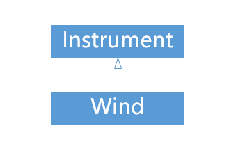

“为新的类提供方法”并不是继承技术中最重要的方面，其最重要的方面是用来表现新类和基类之间的关系。这种关系可以用“**新类是现有类的一种类型**”这句话加以概括。

这个描述并非只是一种解释继承的华丽的方式，这直接是由语言所支撑的。例如，假设有一个`Instrument`的代表乐器的基类和一个称谓`Wind`的导出类。由于继承可以确保基类中所有的方法在导出类中也同样有效，所以能够向基类发送的所有信息同样也可以向导出类发送。如果`Instrument`类具有一个`play()`方法，那么`Wind`乐器也将同样具备。这意味着我们可以准确地说`Wind`对象也是一种类型的`Instrument`。下面这个例子说明了编译器是怎样支持这一概念的：

```java
class Instrument {
	public void play() {}
	static void tune(Instrument i) {
		/* --- */
		i.play();
	}
}

public class Wind extends Instrument {
	public static void main(String[] args) {
		Wind flute = new Wind();
		Instrument.tune(flute); // 向上转型
	}
}
```

在此例中，`tune()`方法可以接受`Instrument`引用，这实在太有趣了。但在`Wind.main()`中，传递给`tune()`方法的是一个`Wind`引用。鉴于Java对类型的检查十分严格，接受某种类型的方法同样可以接受另外一种类型就会显得很奇怪，除非你认识到`Wind`对象同样也是一种`Instrument`对象，而且也不存在任何`tune()`方法是可以通过`Instrument`来调用，同时又不存在于`Wind`之中。在`tune()`中，程序代码可以对`Instrument`和它所有的导出类起作用，这种将`Wind`引用转换为`Instrument`引用的动作，我们称之为**向上转型**。

### **为什么称为向上转型**

该术语的使用有其历史原因，并且是以传统的类继承图的绘制方法为基础的：将根置于页面的顶端，然后逐渐向下。（当然也可以以任何你认为有效的方法进行绘制。）于是，**Wind.java**的继承图就是：



由于导出类转型成基类，在继承图上是向上移动的，因此一般称为**向上转型**。由于向上转型是从一个较专用类型向较通用类型转换，所以总是很安全的。也就是说，导出类是基类的一个超集。它可能比基类含有更多的方法，但它必须至少具备基类中所含有的方法。在向上转型的过程中，类接口唯一可能发生的事情是丢失方法，而不是获取它们。这就是为什么编译器在“未曾明确表示转型”或“未曾指定特殊标记”的情况下，仍然允许向上转型的原因。

### **再论组合与继承**

在面向对象编程中，生成和使用程序代码最有可能采用的方法就是直接将数据和方法包装进一个类中，并使用该类的对象。也可以运用组合技术使用现有类来开发新的类；而继承技术其实是不太常用的。因此尽管在教授OOP的过程中我们多次强调继承，但这并不意味着要尽可能使用它。相反应当慎用这一技术，其使用场合仅限于你确信使用该技术确实有效的情况。**到底是该用组合还是用继承，一个最清晰的判断方法就是问一问自己是否需要从新类向基类进行向上转型。**如果必须向上转型，则继承是必要的；但如果不需要，则应当好好考虑自己是否需要继承。
