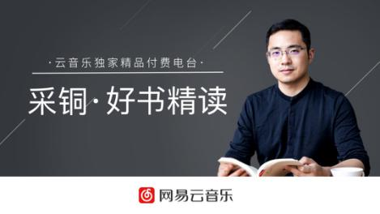

查理芒格认为，现实世界的种种问题，很少是正好落在某一个学科的界限里面的，而往往是横跨多个学科的。但是我们传统的教育又是以学科和专业划界来培养人才。你是哪个专业的，你就只了解这个专业的知识，对别的学科知识一窍不通。一个心理学专业的人，一般不会懂经济学，而一个经济学专业的人，一般也不会懂心理学。但是当你在现实世界中要解决问题的时候，就发现这种狭窄的知识结构很成问题。

### **多元思维模型帮助你正确进行【价值投资】**

我们可能只是简单地认为，价值投资就是不投机，做长线，找有成长性的股票长期持有。道理很多人都懂，但是做不到。为什么？因为你不具备巴菲特和芒格这样的多元知识结构。说白点，就是没有像他们那样懂那么多。所以，价值投资的精华不在于长期持有这样的一种理念，而是你用什么样的知识来挑选出哪家公司是值得长期持有的，这才是特别显功力的地方。

### **我们应该掌握什么样的【普世智慧】**

按照芒格的说法，首先我们并不需要了解所有的学科，我们只要了解最重要的那几个学科就可以了，比如 **数学、物理学、化学、工程学、生物学、心理学、经济学、统计学** 等；其次，对于每一个学科，我们也只需要了解它其中最基本的那几个模型就可以了。掌握了这些基本模型，实际上就掌握了这些学科最主要的智慧。这些基本模型大概有一百个左右，其中最重要的模型，有 **数学中的复利原理，排列组合原理，物理学中的临界点、倾覆力矩，化学中的自我催化模型，生物学中的现代达尔文模型，工程学中的冗余备份模型，** 还有 **心理学中的认知误判模型** 等。

这些模型就组成了芒格所说的“多元思维模型”。这些模型正是我们每个人都应该掌握的“普世价值”。

> 以上内容摘自：【采铜-好书精读】——《穷查理宝典》：三个核心思维方法，吸收巴菲特搭档的人生智慧
