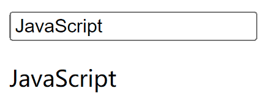

## Vue 数据双向绑定原理

Vue 数据双向绑定是通过 **数据劫持** 结合 **发布者-订阅者模式** 的方式来实现的。

我们先来看下定义在 Vue 初始化数据上的对象是什么样的

**代码：**

``` javascript
new Vue({
  data: {
    obj: {
      foo: 1,
    },
  },
  created() {
    console.log(this.obj)
  },
})
```

**结果：**


可以看到属性 `foo` 有两个对应的 `get` 和 `set` 方法，这两个方法是如何出现的呢？这是因为 Vue 通过 `Object.defineProperty()` 来实现数据劫持的，它可以控制对象属性的一些特有操作，如读写权限、是否可枚举等，这里着重关注 `get` 和 `set` 两个函数。（有关 `Object.defineProperty()` 的更多内容，请点击 [👆MDN-Object.defineProperty](https://developer.mozilla.org/zh-CN/docs/Web/JavaScript/Reference/Global_Objects/Object/defineProperty)）

首先，我们使用字面量形式初始化一个对象属性

**代码：**

```javascript
let book = {
    name: 'JavaScript高级程序设计',
}
console.log(book.name)
console.log(book)
```

**结果：**


我们重新使用 `Object.defineProperty()` 的方式来定义对象属性，并对其 `get` 和 `set` 方法进行重写操作

**代码：**

```javascript
let book = {}
Object.defineProperty(book, 'name', {
    get: () => {
        return '《' + this.name + '》'
    },
    set: (value) => {
        this.name = value
        console.log('设置 name 属性值为：' + value)
    },
})
book.name = 'JavaScript高级程序设计'
console.log(book.name)
console.log(book)
```

**结果：**


可以看到，这次打印出来的数据，和通过 Vue 初始化的数据结构比较像了吧，它也有了 `get` 和 `set` 函数，这正是 Vue 实现 **数据劫持** 的实现原理。

## MVVM 实现思路分析

实现 MVVM 主要包含两个方面：

- 数据变化更新视图
- 视图变化更新数据


其中，view 更新 data 只需要通过事件监听即可，重点是 data 更新 view 是如何做到的呢？

其实，上文 **数据劫持** 的示例已经给出了答案。通过 `Object.defineProperty()` 对属性设置一个 set 函数，当数据改变时，set 函数就会被触发，所以我们只需要将更新 view 的方法写到这里，就可以实现 data 更新 view 了。


## 实现一个监听器 Observer

**监听器** 的作用就是去监听数据的每一个属性，通过上面的例子，我们知道可以用 `Object.defineProperty()` 方法实现。

当监听到属性值发生变化时，通知 **订阅者 Watcher** 执行更新函数去更新视图。

这个过程中，会有许多订阅者，所以我们还需要创建一个 **订阅器 Dep** 来统一管理，订阅器 Dep 有一个容器 subs，负责收集订阅者。

```javascript
function defineReactive(data, key, value) {
    // 递归遍历所有子属性
    observe(value)

    let dep = new Dep()
    Object.defineProperty(data, key, {
        enumerable: true,
        configurable: true,
        get: function reactiveGetter() {
            if (Dep.target) {
                dep.addSub(Dep.target)
            }
            return value
        },
        set: function reactiveSetter(newValue) {
            if (value === newValue) {
                return
            }
            value = newValue
            dep.notify()
        }
    })
}

function observe(data) {
    if (!data || typeof data !== 'object') {
        return
    }
    Object.keys(data).forEach(key => {
        defineReactive(data, key, data[key])
    })
}

function Dep() {
    this.subs = []
}

Dep.prototype = {
    addSub(sub) {
        this.subs.push(sub)
    },
    notify() {
        this.subs.forEach(sub => {
            sub.update()
        })
    }
}

Dep.target = null
```

## 实现一个订阅者 Watcher

**订阅者 Watcher** 的作用主要是接收属性变化的通知，然后去执行视图更新函数。

订阅者 Watcher 初始化时，需要将自己添加到订阅器 Dep 中。我们已经知道在监听器 Observer 的 get 函数中通过订阅器 Dep 执行了添加订阅者 Wather 的操作，所以只需要在 Watcher 初始化时触发 Observer 的 get 函数即可。而要触发 get 函数，只要获取对应的属性值便可触发了，这正是因为我们使用了 `Object.defineProperty()` 进行数据监听。

```javascript
function Watcher(vm, exp, cb) {
    this.vm = vm
    this.exp = exp
    this.cb = cb

    this.value = this.get()
}

Watcher.prototype = {
    update() {
        const value = this.vm.$data[this.exp]
        const oldValue = this.value
        if (value !== oldValue) {
            this.value = value
            this.cb(value)
        }
    },
    get() {
        Dep.target = this
        const value = this.vm.$data[this.exp]
        Dep.target = null
        return value
    }
}
```

## 实现一个解析器 Compile

**解析器 Compile** 的作用主要有两个方面：

1. 解析 DOM 节点，识别出模板指令，替换模板数据
2. 对模板指令的节点添加订阅者，绑定更新函数

为实现这两点功能，我们有如下代码：

```javascript
function Compile(vm) {
    this.vm = vm
    this.el = vm.$el
    this.fragment = null

    this.init()
}

Compile.prototype = {
    init() {
        this.fragment = this.nodeToFragment(this.el)
        this.compileNode(this.fragment)
        this.el.appendChild(this.fragment)
    },

    nodeToFragment(el) {
        const fragment = document.createDocumentFragment()
        let child = el.firstChild
        while (child) {
            fragment.appendChild(child)
            child = el.firstChild
        }
        return fragment
    },
    compileNode(fragment) {
        let childNodes = fragment.childNodes
        const childNodesArray = [...childNodes]
        childNodesArray.forEach(node => {

            if (this.isElementNode(node)) {
                this.compile(node)
            }

            let reg = /\{\{(.*)\}\}/
            let text = node.textContent
            if (reg.test(text)) {
                let prop = reg.exec(text)[1]
                this.compileText(node, prop)
            }

            if (node.childNodes && node.childNodes.length) {
                this.compileNode(node)
            }
        })
    },
    compile(node) {
        let nodeAttrs = node.attributes
        const nodeAttrsArray = [...nodeAttrs]
        nodeAttrsArray.forEach(attr => {
            let name = attr.name
            if (this.isDirective(name)) {
                let value = attr.value
                if (name === 'v-model') {
                    this.compileModel(node, value)
                }
            }
        })
    },
    compileModel(node, prop) {
        let val = this.vm.$data[prop]
        this.updateModel(node, val)

        new Watcher(this.vm, prop, value => {
            this.updateModel(node, value)
        })

        node.addEventListener('input', event => {
            let newValue = event.target.value
            if (val === newValue) {
                return
            }
            this.vm.$data[prop] = newValue
        })
    },
    compileText(node, prop) {
        let text = this.vm.$data[prop]
        this.updateView(node, text)

        new Watcher(this.vm, prop, value => {
            this.updateView(node, value)
        })
    },

    updateModel(node, value) {
        node.value = typeof value === 'undefined' ? '' : value
    },
    updateView(node, value) {
        node.textContent = typeof value === 'undefined' ? '' : value
    },

    isDirective(attr) {
        return attr.indexOf('v-') !== -1
    },
    isElementNode(node) {
        return node.nodeType === 1
    },
    isTextNode(node) {
        return node.nodeType === 3
    },
}
```

这段较长的代码，其核心目的就是实现上面说的 2 点功能。

其中，在解析 DOM 过程中，因为会频繁操作 DOM，所以这里先将其缓存到一个 fragment 中，然后再进行解析，解析编译完成后，再把 fragment 添加到页面中。

这里我们只是简单的实现了差值表达式 `{{}}` 和 `v-model` 的识别。

## 创建 MyVue

这里我们创建一个 MyVue 类，来连接 Observer、Watcher、Compile。

```javascript
function MyVue(options) {
    this.$el = document.querySelector(options.el)
    this.$data = options.data

    this.init()
}

MyVue.prototype = {
    init() {
        this.proxyData(this)
        observe(this.$data)
        new Compile(this)
    },
    proxyData(vm) {
        Object.keys(vm.$data).forEach(key => {
            Object.defineProperty(vm, key, {
                get: function proxyGetter() {
                    return vm.$data[key]
                },
                set: function proxySetter(value) {
                    vm.$data[key] = value
                }
            })
        })
    }
}
```

## 使用 MyVue 替换 Vue

现在，我们使用 MyVue 来替换 Vue 接管我们的视图。

```html
<!DOCTYPE html>
<html lang="en">

<head>
    <!-- ... -->
</head>

<body>
    <div id="app">
        <input v-model='name'>
        <p>{{name}}</p>
    </div>
</body>

<!-- <script src="vender/vue.js"></script> -->
<script src="js/observer.js"></script>
<script src="js/watcher.js"></script>
<script src="js/compile.js"></script>
<script src="js/index.js"></script>
<script>

    // let app = new Vue({
    //     el: '#app',
    //     data: {
    //         name: 'JavaScript',
    //     }
    // })
    // console.log(app)

    let myApp = new MyVue({
        el: '#app',
        data: {
            name: 'JavaScript',
        }
    })
    console.log(myApp)

</script>

</html>
```



到这里，我们便实现了一个简单的数据双向绑定。

## 完整源码

完整源码请点击 [👆GitHub-vue-mvvm](https://github.com/liangpengyv/vue-mvvm) 查看

