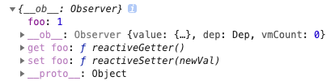
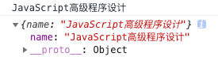
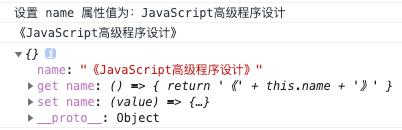

## Vue 数据双向绑定原理

Vue 数据双向绑定是通过 **数据劫持** 结合 **发布者-订阅者模式** 的方式来实现的。

我们先来看下定义在 Vue 初始化数据上的对象是什么样的

**代码：**

``` javascript
new Vue({
  data: {
    obj: {
      foo: 1,
    },
  },
  created() {
    console.log(this.obj)
  },
})
```

**结果：**



可以看到属性 `foo` 有两个对应的 `get` 和 `set` 方法，这两个方法是如何出现的呢？这是因为 Vue 通过 `Object.defineProperty()` 来实现数据劫持的，它可以控制对象属性的一些特有操作，如读写权限、是否可枚举等，这里着重关注 `get` 和 `set` 两个函数。（有关 `Object.defineProperty()` 的更多内容，请点击 [这里](https://developer.mozilla.org/zh-CN/docs/Web/JavaScript/Reference/Global_Objects/Object/defineProperty)）

首先，我们使用字面量形式初始化一个对象属性

**代码：**

```javascript
let book = {
    name: 'JavaScript高级程序设计',
}
console.log(book.name)
console.log(book)
```

**结果：**



我们重新使用 `Object.defineProperty()` 的方式来定义对象属性，并对其 `get` 和 `set` 方法进行重写操作

**代码：**

```javascript
let book = {}
Object.defineProperty(book, 'name', {
    get: () => {
        return '《' + this.name + '》'
    },
    set: (value) => {
        this.name = value
        console.log('设置 name 属性值为：' + value)
    },
})
book.name = 'JavaScript高级程序设计'
console.log(book.name)
console.log(book)
```

**结果：**



可以看到，这次打印出来的数据，和通过 Vue 初始化的数据结构比较像了吧，它也有了 `get` 和 `set` 函数，这正是 Vue 实现 **数据劫持** 的实现原理。
