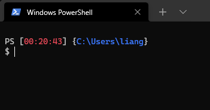

## 查看当前用户 ps1 文件位置

```
echo $Profile
```

得到形如下方的绝对路径，表示当前用户 ps1 配置文件默认加载位置

```
C:\Users\liang\Documents\WindowsPowerShell\Microsoft.PowerShell_profile.ps1
```

## 编辑 ps1 配置文件

编辑这个 ps1 配置文件，可以改变 PowerShell 初始化时的一些行为

如果是第一次使用 PowerShell，这个文件可能不存在，需要我们手动创建

如果当前系统安装有 VScode，可以执行一下命令，快速创建或打开

```
code $Profile
```

下方是我的自定义配置文件内容，可以参考

```
function prompt
{
  Write-Host ("`nPS [") -nonewline
  Write-Host ($(get-date -Format "HH:mm:ss")) -nonewline -foregroundcolor Red
  Write-Host ("] {") -nonewline
  Write-Host ($(pwd)) -nonewline -foregroundcolor Blue
  Write-Host ("}")
  return "$ "
}
```

## 使自定义配置文件生效

一种方式是：

关闭并重新打开当前 PowerShell 会话，修改的配置文件效果便会生效

另一种即时生效的方式是：

执行重新加载命令：

```
. $Profile
```

## 最终效果

